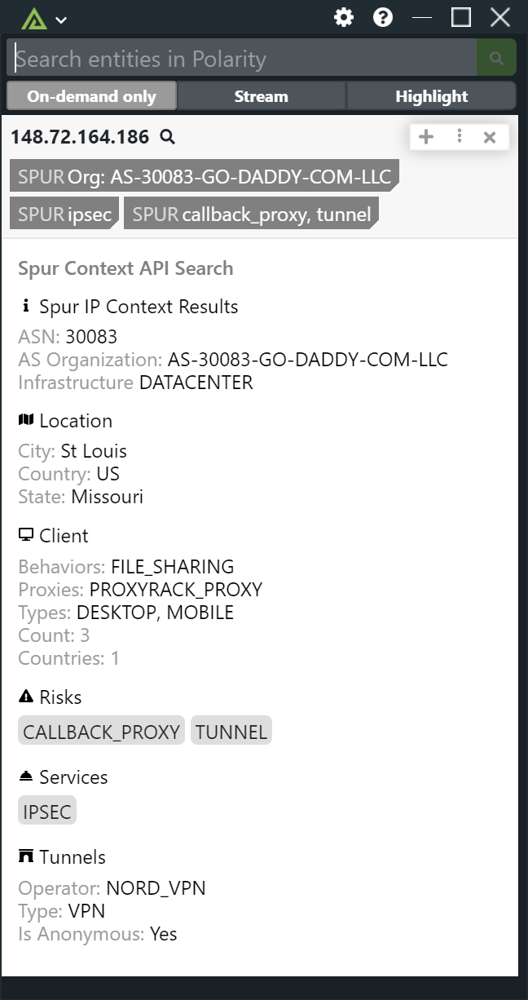

# Polarity Spur Context IP Integration

The Polarity Spur integration allows for IP entity types to be enriched against the Spur Context API.

Learn more about the API here: https://spur.us/products/context-api/

## Installation Instructions

### Spur Context API Key 

Provide your Spur IP Context API Key. 

### IPs To Ignore

A comma-delimited list of IP address or CIDR ranges to ignore.

Installation instructions for integrations are provided on the [PolarityIO GitHub Page](https://polarityio.github.io/).

## Polarity

Polarity is a memory-augmentation platform that improves and accelerates analyst decision making.  For more information about the Polarity platform please see:

https://polarity.io/
